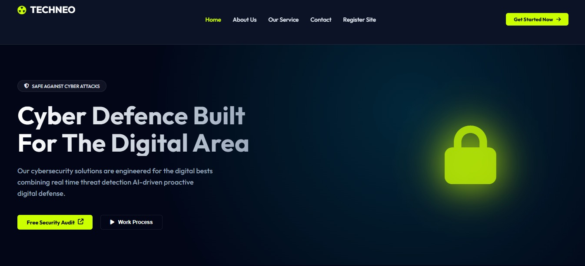
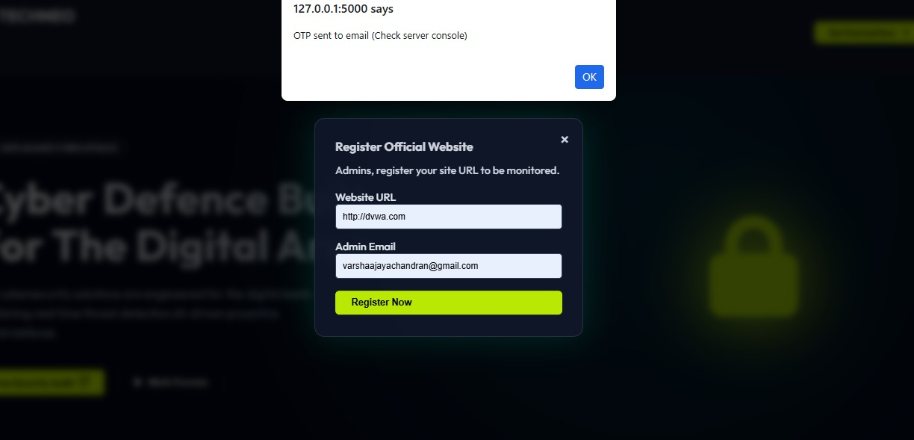
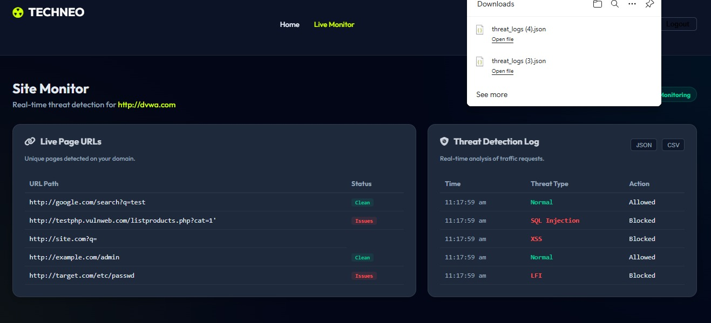
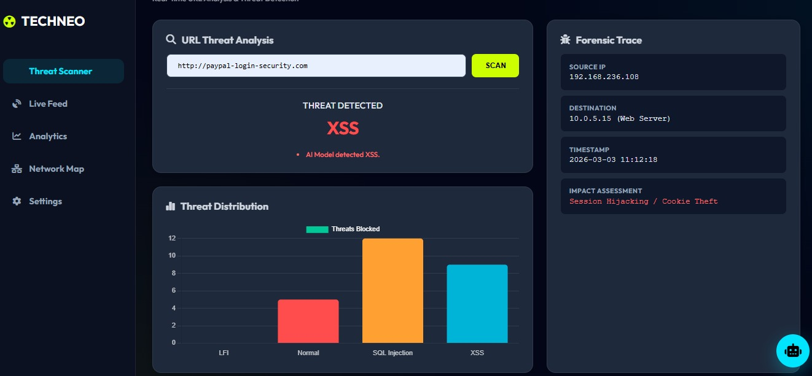
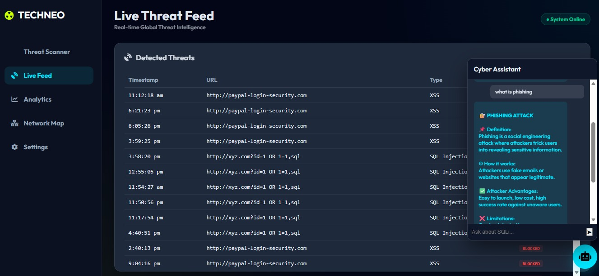

# 🔐 Techneo – Cyber Defence & URL Threat Detection System

> *“Security is not a product, but a process.”*

## 🚀 Overview
**Techneo** is a high-fidelity interactive cybersecurity system designed to simulate real-time **URL threat detection and monitoring**.  
The project demonstrates how modern web applications can identify, analyze, and respond to potential cyber threats such as **XSS, SQL Injection, and malicious URLs**.

This project combines **UI/UX design principles** with **functional interaction flows**, creating a realistic prototype that mimics a live security dashboard.

---

## 🎯 Objectives
- Design a modern cybersecurity interface  
- Simulate real-time **URL threat detection workflow**  
- Provide clear visualization of security threats  
- Create an intuitive and interactive user experience  

---

## 🛠️ Tools & Technologies
- **Frontend:** HTML, CSS, JavaScript  
- **Backend (Simulation):** Python (Flask)  
- **Design & Prototyping:** :contentReference[oaicite:1]{index=1}  
- **Version Control:** :contentReference[oaicite:2]{index=2}  

---

## ✨ Key Features
- 🔍 **URL Threat Scanner** – Analyze URLs for potential threats  
- ⚠️ **Threat Detection Engine** – Identifies:
  - XSS (Cross-Site Scripting)  
  - SQL Injection  
  - LFI (Local File Inclusion)  

- 📊 **Live Monitoring Dashboard**
  - Real-time traffic logs  
  - Threat status (Clean / Issues)  
  - Export logs (JSON / CSV)  

- 🧪 **Forensic Analysis Panel**
  - Source & destination tracking  
  - Attack timestamp  
  - Impact assessment  

- 🔐 **Website Registration System**
  - Admin registers site for monitoring  
  - OTP-based verification (simulated)  

- 🎨 **Modern Cyber UI**
  - Dark theme with neon highlights  
  - Clean and responsive layout  

---

## 🔗 User Flow

1. User lands on **Home Page**  
2. Registers a website for monitoring  
3. Performs **URL threat scan**  
4. Receives detection result (Safe / XSS / SQLi)  
5. Monitors threats in **Live Dashboard**  

---

## 📸 Screenshots

### 🏠 Home Page

### 🔐 Register Website (OTP Verification)

### 🔍 URL Threat Scan

### ⚠️ Threat Detection Result (XSS Example)

### 📊 Live Monitoring Dashboard

---

## 🧪 User Testing & Improvements
- Improved CTA visibility for better navigation  
- Enhanced readability of threat logs  
- Optimized interaction flow between scanning and dashboard  
- Refined UI consistency across pages  

---

## 📈 Outcomes & Learning
- Developed skills in **interactive system design**  
- Understood real-world **cybersecurity workflows**  
- Improved ability to connect **UI with system logic**  
- Learned how to present a **functional prototype effectively**  

---

## 🔮 Future Enhancements
- Integrate real ML-based threat detection  
- Add browser extension for real-time scanning  
- Implement user authentication system  
- Improve mobile responsiveness  
- Connect with live security APIs  

---

## 👩‍💻 Author
**Varsha LJ**  
GitHub:  https://github.com/varsha24-dot

---

## ⭐ Support
If you found this project useful, consider giving it a ⭐ on GitHub!
